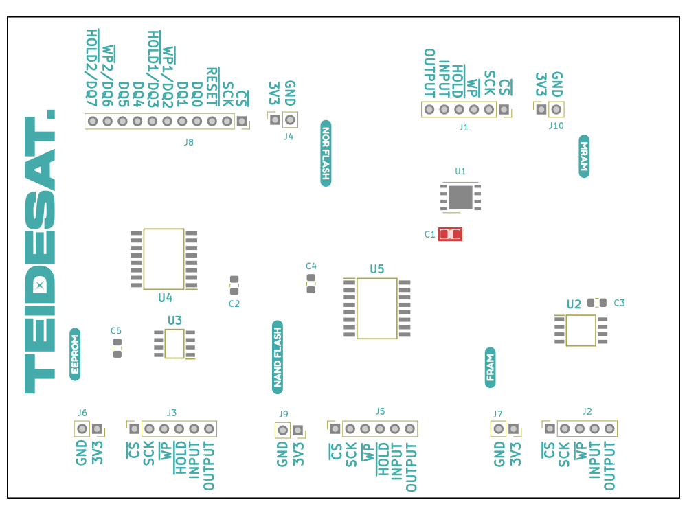

# TEIDESAT-I Radiation memory experiment

Testing the radiation resistance of a FRAM, MRAM, NAND Flash, NOR Flash and EEPROM is one of the experiments of the cubesat TEIDESAT-I; the objective is to verify that the memories are in a failureless operational state.

## Breakout board

An arduino chip is to be connected with the following board:

## TODO

 - Test on real hardware, right now it is all theoretical programming based on the memory datasheets. 30/8/2023

 - In the class EEPROM, change <code>writeByte</code> and <code>writePage</code> to a <code>writeBytes</code> that allows an arbitrary amount of bytes between 1 and 256 to be written (256 is the page size, and it's the maximum size allowed to be written at once). 30/8/2023

 - Because EEPROM has a delay when writing, check if the current code for <code>writeByte</code> and <code>writePage</code> is valid or if they need a delay to take into account the write cycle. Maybe reading the WIP flag on the status register is a viable approach. 30/8/2023

 - In [EEPROM's](lib/Memory/memory_eeprom.cpp) <code>writeByte</code> and <code>writePage</code> an enable write is performed first, but I am unsure about whether it's write enable instruction can be always performed or only if the memory is not busy. 30/8/2023

 - Implement all instructions as member functions on the FRAM memory class. 30/8/2023
 
 - Implement fast read in FRAM memory class. 30/8/2023.
 
 - Expand [NANDFlash](lib/Memory/memory_nand_flash.h) class definition for dual and quad variants for read and  write methods. 5/9/2023
 
 - Update [NAND Flash](lib/Memory/memory_nand_flash.h)'s interface to allow buffer mode read/write. 5/9/2023
 
 - Check if SR Addresses in [NAND Flash](lib/Memory/memory_nand_flash.h) corresponding to SR-1, SR-2, SR-3 are  either 0, 1, 2 respectively or 1, 2, 3. 5/9/2023
 
 - Verify for [NAND Flash](lib/Memory/memory_nand_flash.h) that BUF = 1 after a Page Data Buffer, because
the datasheet (8.2.26) mentions that all instructions will be done in buffer mode after a Page Data Buffer instruction has been performed. 6/9/2023

 - Change [NAND Flash](lib/Memory/memory_nand_flash.h) <code>readByte()</code>'s behavior so that it doesn't always load the data buffer page. Possibly by allowing separate page data load. 6/9/2023
 
 - In [NAND Flash](lib/Memory/memory_nand_flash.h), check if <code>readByte()</code> and <code>readPage()</code> include the 64 ECC bytes on the output or can be accessed. 6/9/2023
 
 - In [NAND Flash](lib/Memory/memory_nand_flash.h), check if write enable and write status register instructions can be executed anytime. 6/9/2023

 - In [NAND Flash](lib/Memory/memory_nand_flash.h), confirm whether <code>eraseBlock</code> does indeed erase the block associated with the addressed page.
